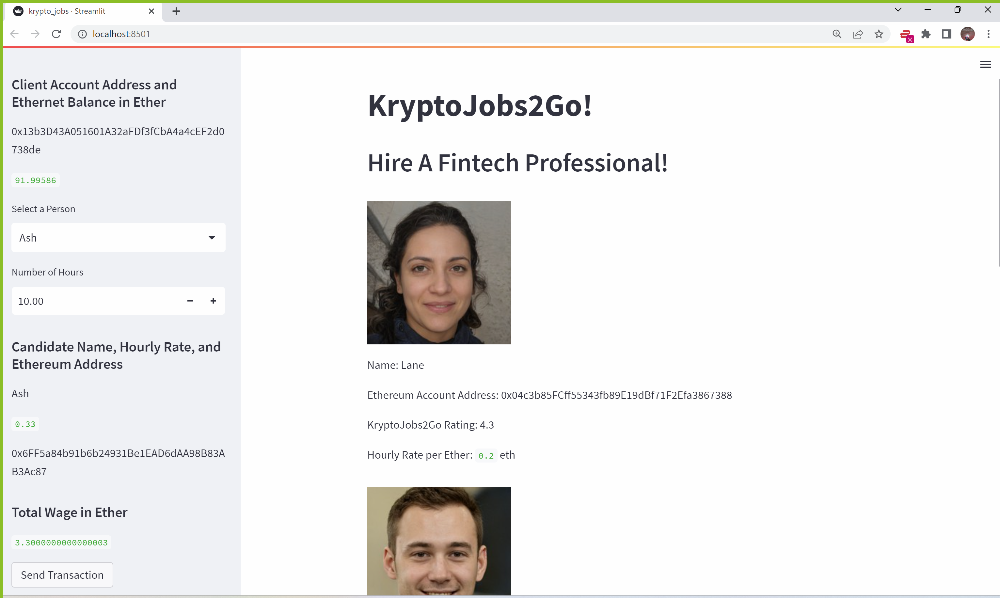
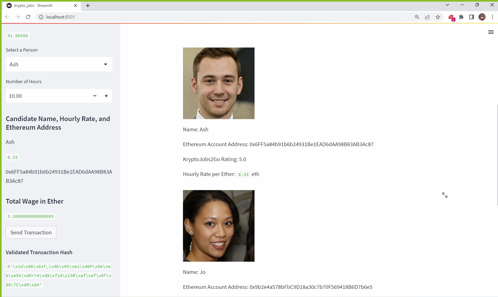
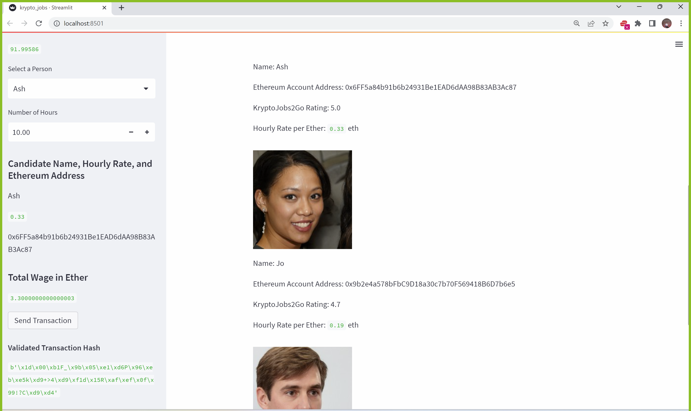

## KryptoJobs2Go app: Find, hire, and pay your fintech professionals with Cryptocurrency Wallets

### KryptoJobs2Go application interface

### Find, hire, and pay your fintech professionals with ethereum

### Execute a Payment and record transactions with the Ethereum blockchain on Ganache

#### Inspect the Transaction on Ganache

 

## Application work for the application 

- All work for the KryptoJobs2Go application interface can be accessed in the following files and folder respectively:

[crypto_wallet.py](https://github.com/visionaryspirit/KryptoJobs2Go_Blockchain_wallet/blob/main/crypto_wallet.py) 

[krypto_jobs.py](https://github.com/visionaryspirit/KryptoJobs2Go_Blockchain_wallet/blob/main/krypto_jobs.py)

[Images](https://github.com/visionaryspirit/KryptoJobs2Go_Blockchain_wallet/tree/main/Images/)

